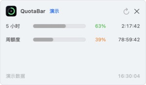

# QuotaBar - Codex Usage Tracker for macOS

[](https://github.com/RoketrP/QuotaBar/releases/latest)
[](https://github.com/RoketrP/QuotaBar/releases/latest)
[](https://github.com/RoketrP/QuotaBar/releases/latest)
[](https://github.com/RoketrP/QuotaBar/actions/workflows/ci.yml)
[](LICENSE)

**Free and open-source Codex usage tracker for the macOS menu bar.** Monitor your remaining 5-hour and weekly usage limits, reset countdowns, and account status without leaving your current app.

QuotaBar 是一款原生 macOS 菜单栏 Codex 用量监控工具。它每 60 秒自动刷新 Codex 剩余用量、5 小时与周额度窗口、重置时间，让你不用反复打开 Codex 或 ChatGPT 查看使用限制。永久免费、开源，不含广告与分析 SDK。

[下载 v1.1.0](https://github.com/RoketrP/QuotaBar/releases/latest) · [使用帮助](https://roketrp.github.io/QuotaBar/) · [爱发电](https://afdian.com/a/codex_used) · [隐私政策](https://roketrp.github.io/QuotaBar/privacy.html) · [问题反馈](https://github.com/RoketrP/QuotaBar/issues)

| 详细用量面板 | 可选悬浮 HUD |
| --- | --- |
|  |  |

## 为什么使用 QuotaBar

- **菜单栏用量监控**：无需切换窗口，直接查看 Codex 剩余百分比。
- **左右键快捷入口**：左键打开详细面板，右键显示用量摘要、刷新、设置和退出菜单。
- **紧凑悬浮 HUD**：可拖动、保持置顶，并记住显示状态、位置与所在屏幕。
- **多个额度窗口**：同时展示 5 小时、周额度及账户返回的其他限制。
- **额度提醒**：显示重置倒计时，并可在剩余量跌破阈值或额度重置后发送系统通知。
- **全局快捷键**：使用 `⌥⌘Q` 随时显示或隐藏悬浮 HUD。
- **本地登录与处理**：使用 Codex 官方 ChatGPT 登录流程，不读取浏览器 Cookie。
- **原生 macOS 体验**：SwiftUI 菜单栏 App，支持开机启动、演示模式和退出账户。
- **免费开源**：MIT 许可，无广告、无分析 SDK，赞助完全自愿。

## 下载与安装

1. 从 [Releases](https://github.com/RoketrP/QuotaBar/releases/latest) 下载 `QuotaBar-v1.1.0-macOS-arm64.zip`。
2. 解压后把 `QuotaBar.app` 拖入“应用程序”文件夹。
3. 首次启动时按住 Control 点击 App，选择“打开”，再在系统提示中确认“打开”。

当前版本支持 macOS 14 或更高版本，以及 Apple 芯片 Mac。由于本项目没有 Apple Developer Program 证书，GitHub 下载版采用临时签名且未经过 Apple 公证；这是首次打开需要额外确认的原因。

发布页同时提供 SHA-256 文件，可用下面的命令核对下载内容：

```bash
shasum -a 256 -c QuotaBar-v1.1.0-macOS-arm64.zip.sha256
```

## 使用

1. 启动 QuotaBar。
2. 登录 ChatGPT，或先使用演示模式查看界面。
3. 左键点击菜单栏图标查看详细额度；右键打开快捷菜单。
4. 在右键菜单或设置中开启悬浮 HUD，也可以按 `⌥⌘Q` 快速显示或隐藏。
5. 如需低额度提醒，在“设置 → 额度提醒”中主动启用系统通知。

QuotaBar 使用 Codex 官方 App Server 读取当前账户授权的额度，不读取浏览器 Cookie，也不要求用户向开发者提供密码或令牌。

## 常见问题

### 如何在 macOS 菜单栏查看 Codex 剩余用量？

安装并登录 QuotaBar 后，菜单栏会直接显示剩余百分比。点击图标可查看 5 小时额度、周额度和对应的重置倒计时。

### QuotaBar 会增加或修改我的 Codex 额度吗？

不会。QuotaBar 只是读取并展示当前 ChatGPT/Codex 账户返回的用量限制，不会购买、增加、转移或绕过额度。

### 是否需要填写 OpenAI API Key？

不需要。QuotaBar 使用 Codex 官方 ChatGPT 登录流程，不要求把 API Key、密码、Cookie 或登录令牌交给开发者。

### 支持哪些 Mac？

当前 GitHub 版本支持 macOS 14 或更高版本的 Apple 芯片 Mac（M1、M2、M3、M4 及后续 Apple Silicon）。暂不提供 Intel 版本。

### 为什么下载包大约有 84 MB？

QuotaBar 的发布包内嵌了固定版本的官方 Codex CLI，用于在本机完成 ChatGPT 登录和读取额度。这样不要求用户预先安装 Node.js、npm 或 Codex CLI，也不会把密码、Cookie 或登录令牌交给开发者。

### 无法启用系统通知怎么办？

通知必须由用户主动授权。如果曾经拒绝，请在“系统设置 → 通知 → QuotaBar”中重新允许。临时预览构建可能因 Bundle ID 或系统注册状态无法申请权限，请优先使用 GitHub Release 中的正式 App 包。

## English Overview

QuotaBar is a native SwiftUI menu bar app for monitoring Codex usage limits on macOS. Version 1.1 adds a compact floating HUD, a native right-click status menu, a global `⌥⌘Q` shortcut, and optional low-quota/reset notifications. QuotaBar is free, MIT-licensed, local-first, and contains no ads or analytics SDKs.

Download the latest Apple Silicon build from [GitHub Releases](https://github.com/RoketrP/QuotaBar/releases/latest). QuotaBar supports macOS 14 or later and does not require an OpenAI API key.

## 自愿赞助

QuotaBar 的所有功能永久免费。赞助金额由你决定，不会解锁功能，也不会改变可用额度。

[在爱发电支持 QuotaBar](https://afdian.com/a/codex_used)（推荐）

<table>
  <tr>
    <th>微信</th>
    <th>支付宝</th>
  </tr>
  <tr>
    <td></td>
    <td></td>
  </tr>
</table>

App 内也可通过“设置 → 查看赞助方式”打开爱发电、微信和支付宝入口。

## 隐私

- 没有开发者后端、广告 SDK 或分析 SDK
- ChatGPT 登录凭证由 Codex 官方流程在本机处理
- 额度快照只保存在运行内存中
- 设置保存在 macOS 本地偏好中
- 爱发电仅在用户点击后由浏览器打开；收款码是静态图片，App 不会自动发起付款或接收支付结果

完整说明见 [隐私政策](https://roketrp.github.io/QuotaBar/privacy.html)。

## 从源码构建

要求：Xcode 16 或更高版本、macOS 14+、Swift 6，以及 `codex-cli 0.136.0`。

```bash
git clone https://github.com/RoketrP/QuotaBar.git
cd QuotaBar
npm install -g @openai/codex@0.136.0
DEVELOPER_DIR=/Applications/Xcode.app/Contents/Developer swift test
./script/build_and_run.sh
```

生成可分发 ZIP：

```bash
CONFIGURATION=release scripts/package_app.sh
```

主要目录：

```text
QuotaBar.xcodeproj       Xcode 工程
Sources/QuotaBar         SwiftUI 菜单栏 App 与 Codex 客户端
Sources/QuotaBarCore     额度模型和 JSON 解析
Tests                    单元测试
docs                     GitHub Pages 帮助与隐私页面
scripts                  打包、图标和 Codex 嵌入脚本
```

## 反馈与安全

- Bug 与功能建议：[GitHub Issues](https://github.com/RoketrP/QuotaBar/issues)
- 安全问题：[Security Policy](SECURITY.md)
- 参与开发：[CONTRIBUTING.md](CONTRIBUTING.md)

提交问题时请勿上传密码、ChatGPT 登录令牌、Cookie 或其他敏感信息。

## 第三方组件与商标

发行包内嵌 Apache-2.0 许可的 OpenAI Codex CLI `0.136.0`，许可文本与声明保存在 `Sources/QuotaBar/Resources/Legal`。

QuotaBar 是独立第三方项目，不是 OpenAI 官方产品，也不受 OpenAI 赞助或认可。Codex、ChatGPT 和 OpenAI 是其各自权利人的商标。

## License

QuotaBar 源码采用 [MIT License](LICENSE)。第三方组件仍适用各自许可证。
